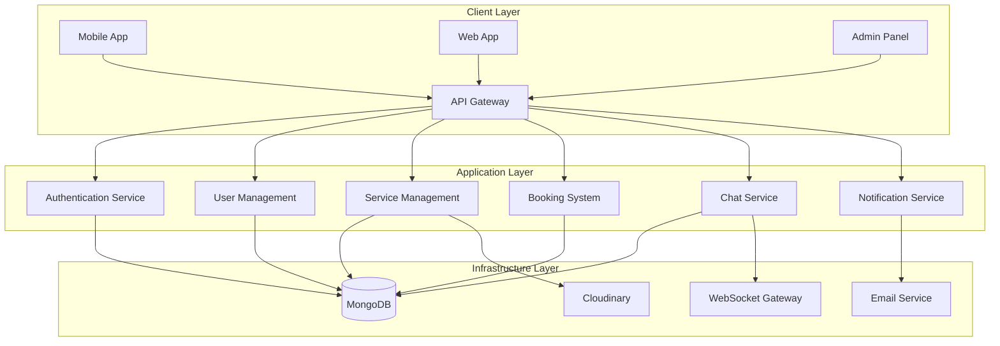
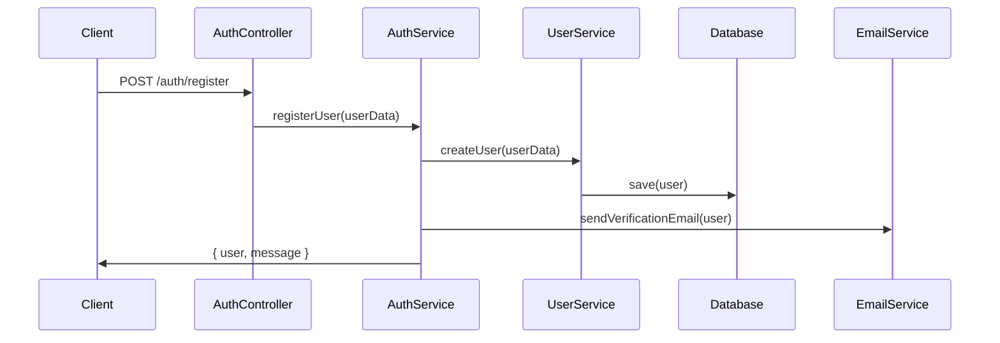
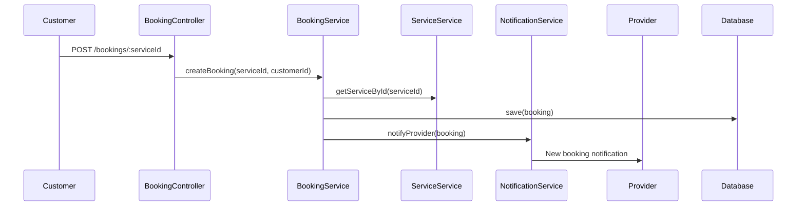
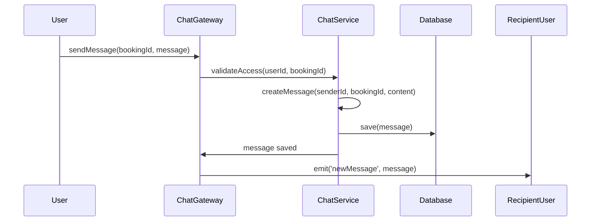
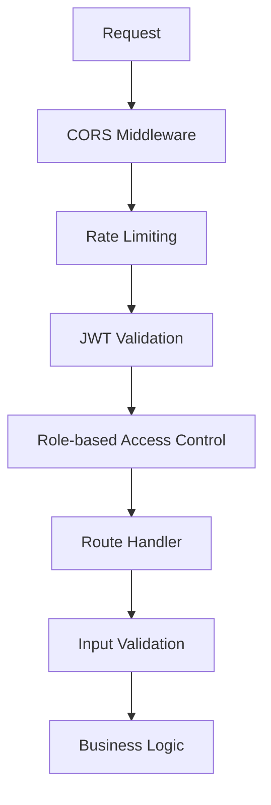

# 🏗️ Service Sphere - System Architecture

## 📋 Table of Contents

- [System Overview](#system-overview)
- [Architecture Patterns](#architecture-patterns)
- [Module Structure](#module-structure)
- [Data Flow](#data-flow)
- [Security Architecture](#security-architecture)
- [Real-time Communication](#real-time-communication)
- [Database Design](#database-design)

## 🌐 System Overview

Service Sphere follows a **modular monolith architecture** with clear separation of concerns, designed to be easily scalable into microservices when needed. The system is built using **Domain-Driven Design (DDD)** principles with clean architecture patterns.

### High-Level Architecture



## 🔧 Architecture Patterns

### 1. Modular Monolith

- **Bounded Contexts**: Each module represents a distinct business domain
- **Loose Coupling**: Modules interact through well-defined interfaces
- **Independent Development**: Teams can work on different modules simultaneously
- **Migration Ready**: Easy transition to microservices architecture

### 2. Dependency Injection Pattern

```typescript
@Injectable()
export class BookingsService {
  constructor(
    @InjectModel(ServiceBookings.name)
    private bookingModel: Model<ServiceBookings>,
    private readonly servicesService: ServicesService,
    private readonly usersService: UsersService,
    private readonly notificationService: NotificationService,
  ) {}
}
```

### 3. Repository Pattern

- Abstract data access layer
- Centralized query logic
- Easy testing with mock repositories
- Database-agnostic business logic

### 4. Observer Pattern (Event-Driven)

```typescript
// Booking status changes trigger notifications
async updateBookingStatus(bookingId: string, status: string) {
  const updatedBooking = await booking.save();

  // Emit event for notification service
  await this.notificationService.sendBookingStatusUpdate(/* ... */);
}
```

## 🏢 Module Structure

### Core Modules

#### 1. Authentication Module (`auth/`)

```
auth/
├── auth.controller.ts      # Auth endpoints
├── auth.service.ts         # Authentication logic
├── auth.module.ts          # Module configuration
├── strategies/             # Passport strategies
├── guards/                 # Route guards
├── decorators/             # Custom decorators
├── dto/                    # Data transfer objects
└── interfaces/             # Type definitions
```

**Responsibilities:**

- User registration and login
- JWT token management
- Email verification
- Password reset functionality
- Role-based access control

#### 2. User Management Module (`users/`)

```
users/
├── users.controller.ts     # User CRUD operations
├── users.service.ts        # User business logic
├── user.module.ts          # Module configuration
├── dto/                    # User DTOs
├── interfaces/             # User interfaces
└── schemas/                # Database schemas
    ├── user.schema.ts
    └── service-provider.schema.ts
```

**Responsibilities:**

- User profile management
- Service provider verification
- Admin user management
- Profile image handling

#### 3. Service Management Module (`services/`)

```
services/
├── services.controller.ts  # Service endpoints
├── services.service.ts     # Service business logic
├── services.module.ts      # Module configuration
├── dto/                    # Service DTOs
├── interfaces/             # Service interfaces
└── schemas/                # Service database schema
```

**Responsibilities:**

- Service listing creation
- Service categorization
- Image upload and management
- Service search and filtering

#### 4. Booking System Module (`service-bookings/`)

```
service-bookings/
├── service-bookings.controller.ts
├── service-bookings.service.ts
├── service-bookings.module.ts
├── dto/
└── schemas/
```

**Responsibilities:**

- Booking creation and management
- Status tracking
- Provider-customer booking coordination
- Booking analytics

#### 5. Real-time Chat Module (`chat/`)

```
chat/
├── chat.gateway.ts         # WebSocket gateway
├── chat.service.ts         # Chat business logic
├── chat.module.ts          # Module configuration
├── dto/                    # Chat DTOs
├── guards/                 # WebSocket guards
└── schemas/                # Chat message schema
```

**Responsibilities:**

- Real-time messaging
- Message persistence
- Chat access control
- Online status management

#### 6. Feedback System Module (`feedback/`)

```
feedback/
├── feedback.controller.ts
├── feedback.service.ts
├── sentiment-analysis.service.ts
├── feedback.module.ts
├── dto/
└── schemas/
```

**Responsibilities:**

- Review and rating management
- Sentiment analysis
- Feedback categorization
- Provider rating calculation

## 🔄 Data Flow

### 1. Authentication Flow



### 2. Service Booking Flow



### 3. Real-time Chat Flow



## 🔐 Security Architecture

### Authentication & Authorization Layers



### Security Features Implemented

1. **JWT Authentication**

   - Access tokens (15 minutes)
   - Refresh tokens (7 days)
   - Token rotation on refresh

2. **Role-Based Access Control (RBAC)**

   ```typescript
   @UseGuards(JwtAuthGuard, RolesGuard)
   @Roles('admin', 'service_provider')
   async createService() { /* ... */ }
   ```

3. **Input Validation**

   ```typescript
   @IsEmail()
   @IsNotEmpty()
   email: string;

   @MinLength(8)
   password: string;
   ```

4. **Data Sanitization**
   - XSS prevention
   - SQL injection protection
   - File upload validation

## 🔄 Real-time Communication

### WebSocket Architecture

```typescript
@WebSocketGateway({
  cors: {
    origin: '*',
  },
})
export class ChatGateway implements OnGatewayConnection, OnGatewayDisconnect {
  @SubscribeMessage('joinBookingRoom')
  async handleJoinRoom(client: Socket, payload: JoinRoomDto) {
    // Validate user access to booking
    const { booking } = await this.chatService.validateUserAccess(
      payload.userId,
      payload.bookingId,
    );

    // Join room for real-time updates
    client.join(`booking-${payload.bookingId}`);
  }
}
```

### Real-time Features

- **Chat messaging** between customers and providers
- **Booking status updates** in real-time
- **Online status** indicators
- **Typing indicators** for enhanced UX

## 💾 Database Design

### MongoDB Schema Design

#### User Collection

```typescript
{
  _id: ObjectId,
  email: String (unique),
  password: String (hashed with bcrypt),
  first_name: String,
  last_name: String,
  full_name: String (computed),
  role: Enum['customer', 'service_provider', 'admin'],
  status: Enum['active', 'suspended'],
  phone_number: String,
  email_verified: Boolean,
  email_verification_otp: String,
  email_verification_expires: Date,
  otp_attempts: Number,
  emailSent: Boolean,
  created_at: Date,
  updated_at: Date,

  // Customer specific fields (discriminator)
  loyalty_points?: Number,
  last_active_time?: Date,
  is_active?: Boolean,

  // Service Provider specific fields (discriminator)
  business_name?: String,
  business_address?: String,
  tax_id?: String,
  verification_status?: Enum['pending', 'approved', 'suspended', 'rejected'],
  verification_date?: Date,
  rating_average?: Number,

  // Admin specific fields (discriminator)
  permissions?: [String]
}
```

#### Service Collection

```typescript
{
  _id: ObjectId,
  service_name: String,
  description: String,
  base_price: Number,
  status: String,
  service_provider: ObjectId (ref: User),
  categories: [ObjectId] (ref: Category),
  images: [String],
  service_attributes: Object (flexible key-value pairs),
  creation_time: Date,
  rating_average: Number
}
```

#### Booking Collection

```typescript
{
  _id: ObjectId,
  customer: ObjectId (ref: User),
  service: ObjectId (ref: Service),
  status: Enum['pending', 'confirmed', 'completed', 'cancelled'],
  booking_date: Date,
  total_amount: Number,
  created_at: Date,
  updated_at: Date
}
```

### Indexing Strategy

```javascript
// User indices
db.users.createIndex({ email: 1 }, { unique: true });
db.users.createIndex({ role: 1 });

// Service indices
db.services.createIndex({ service_provider: 1 });
db.services.createIndex({ categories: 1 });
db.services.createIndex({ status: 1 });

// Booking indices
db.bookings.createIndex({ customer: 1 });
db.bookings.createIndex({ service: 1 });
db.bookings.createIndex({ status: 1 });
```


This architecture documentation demonstrates enterprise-level system design and implementation skills, showcasing:

- **Scalable Architecture Design**
- **Security Best Practices**
- **Real-time System Implementation**
- **Database Design & Optimization**
- **Modern Development Practices**
- **Production-Ready Deployment**
