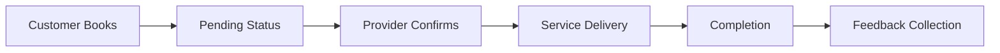

# 🚀 Service Sphere - Feature Documentation

## 📋 Table of Contents

- [Feature Overview](#feature-overview)
- [Authentication & Security](#authentication--security)
- [User Management System](#user-management-system)
- [Service Marketplace](#service-marketplace)
- [Booking Management](#booking-management)
- [Real-time Communication](#real-time-communication)
- [Feedback & Rating System](#feedback--rating-system)
- [AI-Powered Service Recommendations](#ai-powered-service-recommendations)
- [Notification System](#notification-system)
- [Administrative Features](#administrative-features)
- [Integration Features](#integration-features)

## 🌟 Feature Overview

Service Sphere is a comprehensive service marketplace platform that connects customers with service providers through a sophisticated booking and communication system. The platform supports multiple user roles and provides real-time features for seamless interaction.

### Core Value Propositions

- **For Customers**: Easy discovery and booking of local services
- **For Service Providers**: Professional platform to showcase services and manage bookings
- **For Administrators**: Complete platform oversight and management capabilities

## 🔐 Authentication & Security

### Multi-Factor Authentication System

```typescript
// Email verification with OTP
POST /auth/register/customer
{
  "first_name": "John",
  "last_name": "Doe",
  "email": "john@example.com",
  "password": "SecurePass123!",
  "confirm_password": "SecurePass123!"
}

// Response includes OTP sent to email
{
  "user": {
    "_id": "user_id",
    "first_name": "John",
    "last_name": "Doe",
    "email": "john@example.com",
    "role": "customer",
    "email_verified": false
  },
  "emailSent": true
}
```

### Advanced Security Features

#### 1. JWT Token Management

- **Access Tokens**: Short-lived (15 minutes) for API requests
- **Refresh Tokens**: Long-lived (7 days) for token renewal
- **Token Rotation**: Automatic refresh token rotation for security
- **Token Revocation**: Immediate logout and token invalidation

#### 2. Role-Based Access Control (RBAC)

```typescript
// Two main user roles with specific permissions
enum UserRole {
  CUSTOMER = 'customer',                // Book services, leave reviews
  SERVICE_PROVIDER = 'service_provider', // Manage services, handle bookings
  ADMIN = 'admin'                       // Platform administration
}

// Endpoint protection example
@UseGuards(JwtAuthGuard, RolesGuard)
@Roles('service_provider', 'admin')
async createService() { /* Only providers and admins can create services */ }
```

#### 3. Password Security

- **bcrypt Hashing**: Industry-standard password encryption
- **Password Strength Validation**: Minimum 8 characters
- **Secure Reset Process**: Token-based password reset with expiration

#### 4. Email Verification System

- **OTP Generation**: 6-digit codes with 15-minute expiration
- **Resend Capability**: Users can request new verification codes with cooldown
- **Account Activation**: Users must verify email before platform access
- **Rate Limiting**: Maximum 5 OTP attempts with 1-minute cooldown between requests

## 👥 User Management System

### Customer Management

#### Profile Features

- **Personal Information**: Name, email, phone, profile picture
- **Booking History**: Complete history of service bookings
- **Favorite Services**: Save preferred services for quick access
- **Reviews & Ratings**: Manage feedback given to service providers

```typescript
// Customer profile update
PATCH /users/customers/:id
Content-Type: multipart/form-data
{
  "first_name": "Updated Name",
  "profile_image": <file>
}
```

### Service Provider Management

#### Business Profile Features

- **Business Information**: Business name, address, tax ID
- **Verification System**: Multi-step verification process
- **Service Portfolio**: Manage multiple service offerings
- **Performance Analytics**: Booking statistics and ratings

```typescript
// Service provider registration with business details
POST /auth/register/service-provider
{
  "first_name": "Jane",
  "last_name": "Smith",
  "email": "jane@business.com",
  "password": "SecurePass123!",
  "confirm_password": "SecurePass123!",
  "business_name": "Jane's Cleaning Services",
  "business_address": "123 Business St, City",
  "tax_id": "TAX123456789"
}
```

#### Verification Process

1. **Initial Registration**: Basic business information collection
2. **Document Upload**: Tax ID and business license verification
3. **Admin Review**: Manual verification by platform administrators
4. **Status Updates**: Real-time verification status updates

### Admin Management Features

- **User Oversight**: Manage all customers and service providers
- **Platform Analytics**: Comprehensive platform usage statistics
- **Content Moderation**: Review and moderate user-generated content
- **System Configuration**: Manage platform settings and categories

## 🛍️ Service Marketplace

### Service Creation & Management

#### Advanced Service Features

```typescript
// Service creation with rich metadata
POST /services
Content-Type: multipart/form-data
{
  "service_name": "Premium House Cleaning",
  "description": "Professional deep cleaning service",
  "base_price": 150.00,
  "status": "active",
  "categories": ["category_id_1", "category_id_2"],
  "service_attributes": {
    "duration": "3-4 hours",
    "equipment_included": true,
    "eco_friendly": true,
    "insurance_covered": true
  },
  "images": [<file1>, <file2>]
}
```

#### Service Discovery Features

- **Category-based Browsing**: Organized service categories
- **Search Functionality**: Advanced search with filters
- **Provider Filtering**: Find services by specific providers
- **Geographic Search**: Location-based service discovery
- **Price Range Filtering**: Budget-based service selection

### Image Management System

```typescript
// Cloudinary integration for professional image handling
const uploadResults = await Promise.all(
  files.map((file) =>
    this.cloudinary.uploadFile(file, {
      folder: 'ServiceSphere',
      transformation: [
        { width: 800, height: 600, crop: 'fill' },
        { quality: 'auto' },
        { format: 'webp' },
      ],
    }),
  ),
);
```

### Category Management

- **Dynamic Categories**: Admin-managed service categories
- **Hierarchical Structure**: Support for subcategories
- **Category Analytics**: Popular categories and trends

## 📅 Booking Management

### Comprehensive Booking System

#### Booking Lifecycle



#### Booking Features

```typescript
// Create booking with automatic notifications
POST /bookings/:serviceId
// No request body required - booking created with pending status

// Automatic response with booking details
{
  "_id": "booking_123",
  "customer": "customer_id",
  "service": {
    "_id": "service_id",
    "service_name": "Premium House Cleaning",
    "service_provider": {
      "_id": "provider_id",
      "business_name": "Clean Pro Services"
    }
  },
  "status": "pending",
  "created_at": "2024-07-15T10:00:00Z",
  "updated_at": "2024-07-15T10:00:00Z"
}
```

### Status Management System

- **Pending**: Initial booking state awaiting provider confirmation
- **Confirmed**: Provider has accepted the booking
- **Completed**: Service has been finished
- **Cancelled**: Booking was cancelled by either party

### Provider Booking Management

```typescript
// Providers can view and manage their bookings
GET /bookings/provider
// Returns all bookings for the authenticated provider

PATCH /bookings/:id/status
{
  "status": "confirmed"
}
```

## 💬 Real-time Communication

### WebSocket-Based Chat System

#### Secure Chat Access

```typescript
// Chat access tied to active bookings
@SubscribeMessage('joinRoom')
async handleJoinRoom(client: Socket, payload: JoinRoomDto) {
  // Validate user has access to this booking
  const { booking } = await this.chatService.validateUserAccess(
    payload.userId,
    payload.bookingId
  );

  // Only allow chat for active bookings
  if (['completed', 'cancelled'].includes(booking.status)) {
    throw new ForbiddenException('Chat is closed for this booking');
  }

  client.join(`booking_${payload.bookingId}`);
}
```

#### Real-time Features

- **Instant Messaging**: Real-time message delivery
- **Message Persistence**: All messages stored for history
- **Online Status**: Real-time user presence indicators
- **Typing Indicators**: Enhanced user experience
- **Message Read Receipts**: Delivery confirmation

### Chat Security & Privacy

- **Booking-Specific**: Chats are isolated to individual bookings
- **Access Control**: Only booking participants can access chat
- **Message Encryption**: Secure message transmission
- **Chat History**: Complete conversation history for reference

## ⭐ Feedback & Rating System

### AI-Powered Sentiment Analysis

#### Advanced Feedback Processing

```typescript
// Automatic sentiment analysis on feedback submission
async create(createFeedbackDto: CreateFeedbackDto, userId: string) {
  // Validate booking and user access
  const booking = await this.bookingModel.findById(createFeedbackDto.booking);

  if (booking.status !== 'completed') {
    throw new BadRequestException('You can only leave feedback for completed bookings');
  }

  // Analyze sentiment of the review text
  const sentimentResult = await this.sentimentAnalysisService.analyzeSentiment(
    createFeedbackDto.message
  );

  const feedback = new this.feedbackModel({
    ...createFeedbackDto,
    user: userId,
    sentiment: sentimentResult.sentiment,
    sentimentScore: sentimentResult.score,
  });

  // Update service and provider ratings
  await this.updateServiceRating(feedback.service.toString());

  return feedback.save();
}
```

#### Rating System Features

- **5-Star Rating**: Numerical rating system (1-5 stars)
- **Detailed Reviews**: Text-based feedback with sentiment analysis
- **Multi-language Support**: Arabic and English sentiment analysis
- **Provider Ratings**: Aggregate rating calculations for service providers
- **Service Ratings**: Individual service rating calculations
- **Review Validation**: Only customers who completed bookings can review
- **Duplicate Prevention**: One review per customer per booking

### Review Management

```typescript
// Comprehensive feedback endpoints
GET /feedback/service/:id      // All reviews for a service
GET /feedback/provider/:id     // All reviews for a provider
GET /feedback/customer         // Current user's feedback
GET /feedback/customer/:id     // Specific customer's feedback
POST /feedback                 // Submit new feedback
DELETE /feedback/:id           // Delete own feedback (or admin)
```

## 🤖 AI-Powered Service Recommendations

### Intelligent Advice System

Service Sphere features an advanced AI-powered advice system that provides personalized recommendations to service providers based on customer feedback analysis.

#### Smart Feedback Analysis

```typescript
// Get AI-powered advice for service providers
GET /advice/me
Authorization: Bearer <service_provider_token>

// AI analyzes all feedback and provides actionable insights
{
  "advice": "Based on your recent feedback analysis..."
}
```

#### Key Features

- **Multi-language Analysis**: Supports both Arabic and English feedback
- **Automatic Language Detection**: Identifies dominant language in feedback
- **Sentiment Categorization**: Groups feedback into positive, neutral, and negative
- **Actionable Insights**: Provides specific recommendations for improvement
- **Hugging Face Integration**: Uses advanced NLP models for advice generation

#### Technical Implementation

```typescript
async getAdviceForServiceProvider(providerId: string): Promise<string> {
  // Collect all feedback for provider's services
  const services = await this.servicesService.getAllServicesByProviderId(providerId);
  const feedback = [];

  for (const service of services) {
    const serviceFeedback = await this.feedbackService.getAllFeedbackByServiceId(
      service._id.toString()
    );
    feedback.push(...serviceFeedback);
  }

  // Detect dominant language (Arabic/English)
  const dominantLanguage = this.detectDominantLanguage(feedback);

  // Format feedback for AI analysis
  const feedbackText = this.formatFeedbackForAdvice(feedback, dominantLanguage);

  // Get AI-powered advice
  return await this.callHuggingFaceModel(feedbackText, dominantLanguage);
}
```

#### Language Support

- **Arabic Feedback**: Native Arabic language processing and response
- **English Feedback**: English language analysis and recommendations
- **Language Detection**: Automatic detection based on character analysis
- **Bilingual Responses**: AI responds in the detected dominant language

## 📧 Notification System

### Multi-Channel Notifications

#### Email Notifications

```typescript
// Professional email templates with Handlebars
await this.mailService.sendBookingConfirmation(
  customer.email,
  customer.first_name,
  {
    bookingId: booking._id,
    serviceName: service.service_name,
    providerName: provider.business_name || provider.full_name,
  },
);
```

#### Notification Types

- **Welcome Emails**: New user onboarding with OTP verification
- **Booking Notifications**: New booking alerts for providers
- **Status Updates**: Booking status change notifications
- **Email Verification**: Account verification with OTP codes
- **Password Reset**: Secure password recovery with tokens
- **Real-time Notifications**: In-app notifications through WebSocket

### Email Template System

- **Handlebars Templates**: Dynamic content rendering
- **Brand Consistency**: Professional email design
- **Responsive Design**: Mobile-optimized emails
- **Personalization**: User-specific content

## 🔧 Administrative Features

### Comprehensive Admin Panel

#### User Management

```typescript
// Admin-only endpoints for user management
GET /users/customers           // List all customers
GET /users/service-providers   // List all providers
GET /users/admins              // List all admins (admin only)
PATCH /users/customers/:id     // Update customer
PATCH /users/service-providers/:id // Update provider
DELETE /users/customers/:id    // Remove customer
DELETE /users/service-providers/:id // Remove provider
```

#### Platform Analytics

- **User Statistics**: Registration and activity metrics
- **Booking Analytics**: Platform usage and booking trends
- **Service Performance**: Popular services and categories
- **Provider Verification**: Manage verification status
- **Real-time Monitoring**: Live platform statistics

#### Content Moderation

- **Review Management**: Monitor and manage user feedback
- **Service Oversight**: Review and manage service listings
- **User Verification**: Manual verification processes
- **Category Management**: Add/edit service categories via dedicated endpoints

### Admin Security Features

- **API Key Protection**: Secure admin registration with API keys
- **Role-based Access**: Strict admin-only endpoints
- **First Admin Setup**: Special endpoint for initial admin creation
- **Permission Management**: Granular admin permissions system

## 🔗 Integration Features

### Third-Party Service Integration

#### Cloudinary Integration

```typescript
// Professional image management with automatic optimization
const uploadResult = await this.cloudinary.uploadFile(file, {
  folder: 'ServiceSphere',
  transformation: [
    { width: 800, height: 600, crop: 'fill' },
    { quality: 'auto' },
    { format: 'webp' },
  ],
});
```

#### AI/ML Service Integration

- **Hugging Face Models**: Advanced NLP for sentiment analysis and advice generation
- **Multi-language Processing**: Arabic and English language support
- **Sentiment Analysis**: Real-time feedback sentiment classification
- **Recommendation Engine**: AI-powered service improvement suggestions

#### Email Service Integration

- **SMTP Configuration**: Professional email delivery with Nodemailer
- **Template Engine**: Dynamic email content with Handlebars
- **Delivery Tracking**: Email delivery status monitoring
- **Multi-template Support**: Welcome, verification, password reset templates

### Database Integration

- **MongoDB**: Scalable NoSQL database with Mongoose ODM
- **Discriminator Pattern**: Role-based user schemas (Customer, ServiceProvider, Admin)
- **Index Optimization**: Performance-optimized queries for users, services, bookings
- **Schema Validation**: Robust data validation with class-validator
- **Relationship Management**: Proper document relationships and population

## 📊 Analytics & Reporting

### Business Intelligence Features

- **Booking Trends**: Track booking patterns and status distribution
- **User Engagement**: User registration and activity metrics
- **Service Performance**: Popular services and provider rankings
- **Rating Analytics**: Average ratings and sentiment analysis results

### Performance Monitoring

- **Real-time Notifications**: WebSocket-based notification delivery
- **Response Optimization**: Efficient database queries with proper indexing
- **Error Handling**: Comprehensive error tracking and logging
- **API Performance**: Monitoring endpoint response times and usage

## 🚀 Technical Excellence

### Code Quality Features

- **TypeScript**: Type-safe development with strict typing
- **Clean Architecture**: SOLID principles and modular design
- **Dependency Injection**: NestJS dependency injection container
- **Comprehensive Validation**: DTOs with class-validator decorators
- **Error Handling**: Global exception filters with standardized responses

### Performance Optimization

- **Database Indexing**: Optimized MongoDB indexes for key queries
- **Image Optimization**: Cloudinary automatic image processing
- **Connection Pooling**: Efficient database connection management
- **Caching Strategy**: Strategic data caching for performance
- **Load Balancing**: Horizontal scaling support with Docker

### Security Implementation

- **JWT Authentication**: Secure token-based authentication
- **Password Hashing**: bcrypt with salt rounds
- **Role-based Guards**: Decorator-based access control
- **Input Sanitization**: XSS and injection protection
- **Rate Limiting**: API rate limiting and abuse prevention

---

This feature documentation demonstrates:

- **Full-Stack Capability**: Complete backend system with real-world features
- **AI Integration**: Advanced machine learning and NLP capabilities
- **Production Ready**: Comprehensive security, validation, and error handling
- **Scalable Architecture**: Clean, modular design ready for growth
- **Multi-language Support**: Arabic and English language processing
- **Real-time Features**: WebSocket implementation for live interactions
