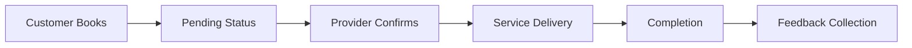

# 🚀 Service Sphere - Feature Documentation

## 📋 Table of Contents
- [Feature Overview](#feature-overview)
- [Authentication & Security](#authentication--security)
- [User Management System](#user-management-system)
- [Service Marketplace](#service-marketplace)
- [Booking Management](#booking-management)
- [Real-time Communication](#real-time-communication)
- [Feedback & Rating System](#feedback--rating-system)
- [Notification System](#notification-system)
- [Administrative Features](#administrative-features)
- [Integration Features](#integration-features)

## 🌟 Feature Overview

Service Sphere is a comprehensive service marketplace platform that connects customers with service providers through a sophisticated booking and communication system. The platform supports multiple user roles and provides real-time features for seamless interaction.

### Core Value Propositions
- **For Customers**: Easy discovery and booking of local services
- **For Service Providers**: Professional platform to showcase services and manage bookings
- **For Administrators**: Complete platform oversight and management capabilities

## 🔐 Authentication & Security

### Multi-Factor Authentication System
```typescript
// Email verification with OTP
POST /api/v1/auth/register/customer
{
  "first_name": "John",
  "last_name": "Doe",
  "email": "john@example.com",
  "password": "SecurePass123!",
  "phone_number": "+1234567890"
}

// Response includes OTP sent to email
{
  "status": "success",
  "data": {
    "user": { /* user data */ },
    "message": "Verification email sent",
    "emailSent": true
  }
}
```

### Advanced Security Features

#### 1. JWT Token Management
- **Access Tokens**: Short-lived (15 minutes) for API requests
- **Refresh Tokens**: Long-lived (7 days) for token renewal
- **Token Rotation**: Automatic refresh token rotation for security
- **Token Revocation**: Immediate logout and token invalidation

#### 2. Role-Based Access Control (RBAC)
```typescript
// Three distinct user roles with specific permissions
enum UserRole {
  CUSTOMER = 'customer',           // Book services, leave reviews
  SERVICE_PROVIDER = 'service_provider',  // Manage services, handle bookings
  ADMIN = 'admin'                 // Platform administration
}

// Endpoint protection example
@UseGuards(JwtAuthGuard, RolesGuard)
@Roles('service_provider', 'admin')
async createService() { /* Only providers and admins can create services */ }
```

#### 3. Password Security
- **bcrypt Hashing**: Industry-standard password encryption
- **Password Strength Validation**: Minimum 8 characters with complexity requirements
- **Secure Reset Process**: Token-based password reset with expiration

#### 4. Email Verification System
- **OTP Generation**: 6-digit codes with 10-minute expiration
- **Resend Capability**: Users can request new verification codes
- **Account Activation**: Users must verify email before platform access

## 👥 User Management System

### Customer Management

#### Profile Features
- **Personal Information**: Name, email, phone, profile picture
- **Booking History**: Complete history of service bookings
- **Favorite Services**: Save preferred services for quick access
- **Reviews & Ratings**: Manage feedback given to service providers

```typescript
// Customer profile update
PATCH /api/v1/users/customers/:id
{
  "first_name": "Updated Name",
  "profile_image": "base64_or_url"
}
```

### Service Provider Management

#### Business Profile Features
- **Business Information**: Business name, address, tax ID
- **Verification System**: Multi-step verification process
- **Service Portfolio**: Manage multiple service offerings
- **Performance Analytics**: Booking statistics and ratings

```typescript
// Service provider registration with business details
POST /api/v1/auth/register/service-provider
{
  "first_name": "Jane",
  "last_name": "Smith",
  "email": "jane@business.com",
  "business_name": "Jane's Cleaning Services",
  "business_address": "123 Business St, City",
  "tax_id": "TAX123456789",
  "password": "SecurePass123!"
}
```

#### Verification Process
1. **Initial Registration**: Basic business information collection
2. **Document Upload**: Tax ID and business license verification
3. **Admin Review**: Manual verification by platform administrators
4. **Status Updates**: Real-time verification status updates

### Admin Management Features
- **User Oversight**: Manage all customers and service providers
- **Platform Analytics**: Comprehensive platform usage statistics
- **Content Moderation**: Review and moderate user-generated content
- **System Configuration**: Manage platform settings and categories

## 🛍️ Service Marketplace

### Service Creation & Management

#### Advanced Service Features
```typescript
// Service creation with rich metadata
POST /api/v1/services
{
  "service_name": "Premium House Cleaning",
  "description": "Professional deep cleaning service",
  "base_price": 150.00,
  "categories": ["cleaning", "home-services"],
  "service_attributes": {
    "duration": "3-4 hours",
    "equipment_included": true,
    "eco_friendly": true,
    "insurance_covered": true
  },
  "images": ["image1.jpg", "image2.jpg"]
}
```

#### Service Discovery Features
- **Category-based Browsing**: Organized service categories
- **Search Functionality**: Advanced search with filters
- **Provider Filtering**: Find services by specific providers
- **Geographic Search**: Location-based service discovery
- **Price Range Filtering**: Budget-based service selection

### Image Management System
```typescript
// Cloudinary integration for professional image handling
const uploadResults = await Promise.all(
  files.map(file => 
    this.cloudinary.uploadFile(file, {
      folder: 'ServiceSphere',
      transformation: [
        { width: 800, height: 600, crop: 'fill' },
        { quality: 'auto' },
        { format: 'webp' }
      ]
    })
  )
);
```

### Category Management
- **Dynamic Categories**: Admin-managed service categories
- **Hierarchical Structure**: Support for subcategories
- **Category Analytics**: Popular categories and trends

## 📅 Booking Management

### Comprehensive Booking System

#### Booking Lifecycle


#### Booking Features
```typescript
// Create booking with automatic notifications
POST /api/v1/bookings/:serviceId
{
  "preferred_date": "2024-07-15T10:00:00Z",
  "special_instructions": "Please bring eco-friendly supplies"
}

// Automatic response with booking details
{
  "status": "success",
  "data": {
    "booking_id": "booking_123",
    "status": "pending",
    "service": { /* service details */ },
    "provider": { /* provider info */ },
    "estimated_completion": "2024-07-15T14:00:00Z"
  }
}
```

### Status Management System
- **Pending**: Initial booking state awaiting provider confirmation
- **Confirmed**: Provider has accepted the booking
- **In Progress**: Service is currently being delivered
- **Completed**: Service has been finished
- **Cancelled**: Booking was cancelled by either party

### Provider Booking Management
```typescript
// Providers can view and manage their bookings
GET /api/v1/bookings/provider
// Returns all bookings for the authenticated provider

PATCH /api/v1/bookings/:id/status
{
  "status": "confirmed",
  "estimated_start_time": "2024-07-15T10:00:00Z"
}
```

## 💬 Real-time Communication

### WebSocket-Based Chat System

#### Secure Chat Access
```typescript
// Chat access tied to active bookings
@SubscribeMessage('joinBookingRoom')
async handleJoinRoom(client: Socket, payload: JoinRoomDto) {
  // Validate user has access to this booking
  const { booking, providerId } = await this.chatService.validateUserAccess(
    payload.userId,
    payload.bookingId
  );
  
  // Only allow chat for active bookings
  if (['completed', 'cancelled'].includes(booking.status)) {
    throw new ForbiddenException('Chat is closed for this booking');
  }
  
  client.join(`booking-${payload.bookingId}`);
}
```

#### Real-time Features
- **Instant Messaging**: Real-time message delivery
- **Message Persistence**: All messages stored for history
- **Online Status**: Real-time user presence indicators
- **Typing Indicators**: Enhanced user experience
- **Message Read Receipts**: Delivery confirmation

### Chat Security & Privacy
- **Booking-Specific**: Chats are isolated to individual bookings
- **Access Control**: Only booking participants can access chat
- **Message Encryption**: Secure message transmission
- **Chat History**: Complete conversation history for reference

## ⭐ Feedback & Rating System

### AI-Powered Sentiment Analysis

#### Advanced Feedback Processing
```typescript
// Automatic sentiment analysis on feedback submission
async create(createFeedbackDto: CreateFeedbackDto, userId: string) {
  // Analyze sentiment of the review text
  const sentimentResult = await this.sentimentAnalysisService.analyzeSentiment(
    createFeedbackDto.review_text
  );
  
  const feedback = new this.feedbackModel({
    ...createFeedbackDto,
    user: userId,
    sentiment_score: sentimentResult.score,
    sentiment_magnitude: sentimentResult.magnitude,
    created_at: new Date()
  });
  
  return feedback.save();
}
```

#### Rating System Features
- **5-Star Rating**: Numerical rating system
- **Detailed Reviews**: Text-based feedback
- **Sentiment Analysis**: AI-powered sentiment scoring
- **Provider Ratings**: Aggregate rating calculations
- **Review Moderation**: Admin oversight for inappropriate content

### Review Management
```typescript
// Comprehensive feedback endpoints
GET /api/v1/feedback/service/:id      // All reviews for a service
GET /api/v1/feedback/provider/:id     // All reviews for a provider
POST /api/v1/feedback                 // Submit new feedback
DELETE /api/v1/feedback/:id           // Delete own feedback (or admin)
```

## 📧 Notification System

### Multi-Channel Notifications

#### Email Notifications
```typescript
// Professional email templates with Handlebars
await this.mailService.sendBookingConfirmation(
  customer.email,
  customer.first_name,
  {
    bookingId: booking._id,
    serviceName: service.service_name,
    providerName: provider.business_name,
    scheduledDate: booking.scheduled_date,
    totalAmount: booking.total_amount
  }
);
```

#### Notification Types
- **Welcome Emails**: New user onboarding
- **Booking Confirmations**: Booking status updates
- **Payment Notifications**: Transaction confirmations
- **Verification Emails**: Account verification
- **Password Reset**: Secure password recovery
- **Provider Alerts**: New booking notifications

### Email Template System
- **Handlebars Templates**: Dynamic content rendering
- **Brand Consistency**: Professional email design
- **Responsive Design**: Mobile-optimized emails
- **Personalization**: User-specific content

## 🔧 Administrative Features

### Comprehensive Admin Panel

#### User Management
```typescript
// Admin-only endpoints for user management
GET /api/v1/users/customers           // List all customers
GET /api/v1/users/service-providers   // List all providers
PATCH /api/v1/users/:id               // Update any user
DELETE /api/v1/users/:id              // Remove users
```

#### Platform Analytics
- **User Statistics**: Registration and activity metrics
- **Booking Analytics**: Platform usage and revenue data
- **Service Performance**: Popular services and categories
- **Provider Verification**: Manage verification queue

#### Content Moderation
- **Review Moderation**: Flag inappropriate reviews
- **Service Approval**: Review new service listings
- **User Verification**: Manual user verification process
- **Category Management**: Add/edit service categories

### Admin Security Features
- **API Key Protection**: Secure admin registration
- **Audit Logging**: Track administrative actions
- **Role Separation**: Clear admin vs. user boundaries

## 🔗 Integration Features

### Third-Party Service Integration

#### Cloudinary Integration
```typescript
// Professional image management
const uploadResult = await this.cloudinary.uploadFile(file, {
  folder: 'ServiceSphere',
  transformation: [
    { width: 800, height: 600, crop: 'fill' },
    { quality: 'auto:best' },
    { format: 'webp' }
  ]
});
```

#### Email Service Integration
- **SMTP Configuration**: Professional email delivery
- **Template Engine**: Dynamic email content
- **Delivery Tracking**: Email delivery confirmation
- **Bounce Handling**: Failed delivery management

### Database Integration
- **MongoDB**: Scalable NoSQL database
- **Mongoose ODM**: Object document mapping
- **Index Optimization**: Performance-optimized queries
- **Data Validation**: Schema-level validation

## 📊 Analytics & Reporting

### Business Intelligence Features
- **Booking Trends**: Track booking patterns and seasonality
- **Revenue Analytics**: Platform revenue and commission tracking
- **User Engagement**: User activity and retention metrics
- **Service Performance**: Popular services and provider rankings

### Performance Monitoring
- **Response Time Tracking**: API performance monitoring
- **Error Rate Monitoring**: System health tracking
- **User Behavior Analytics**: Platform usage patterns
- **Conversion Tracking**: Booking success rates

## 🚀 Technical Excellence

### Code Quality Features
- **TypeScript**: Type-safe development
- **Clean Architecture**: SOLID principles implementation
- **Comprehensive Testing**: Unit and integration tests
- **Documentation**: Extensive code documentation
- **Error Handling**: Graceful error management

### Performance Optimization
- **Database Indexing**: Optimized query performance
- **Caching Strategy**: Redis-based caching
- **Image Optimization**: Automated image processing
- **Load Balancing**: Horizontal scaling support

---

This feature documentation demonstrates:

- **Full-Stack Capability**: Complete backend system development
- **Real-World Application**: Production-ready features
- **Technical Depth**: Advanced implementation details
- **Business Value**: Clear value propositions for users
- **Scalability**: Enterprise-grade architecture
- **Security**: Comprehensive security implementation
